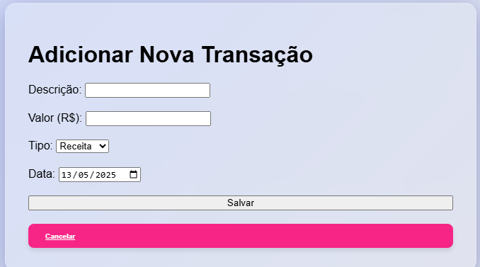

Controle de Finanças Pessoais
Descrição
O Controle de Finanças Pessoais é um sistema simples para gerenciar transações financeiras, desenvolvido em PHP e MySQL. Ele permite aos usuários adicionar, editar e excluir receitas e despesas, além de visualizar o saldo atual e controlar o histórico financeiro de forma eficiente. É um sistema ideal para quem deseja acompanhar suas finanças pessoais de maneira simples e prática.

Funcionalidades
Cadastro de Transações: Registre receitas e despesas com descrição, valor e data.

Visualização de Transações: Exiba todas as transações cadastradas, com filtro por tipo (receita ou despesa).

Edição de Transações: Altere dados de transações cadastradas, como valores ou descrições.

Exclusão de Transações: Exclua transações com confirmação para garantir segurança.

Cálculo do Saldo: Visualize o total de receitas, despesas e o saldo atual.

Segurança: Proteção contra CSRF (Cross-Site Request Forgery) com token de segurança.

Interface Simples e Intuitiva: Layout responsivo e amigável para o usuário.

Tecnologias Utilizadas
PHP: Linguagem de programação para o backend.

MySQL: Banco de dados para armazenar transações financeiras.

CSS: Para criar uma interface visual agradável e responsiva.

JavaScript: Utilizado para modais interativos e validações no frontend.

XAMPP: Usado para rodar o servidor Apache e o banco de dados MySQL localmente.

Instalação
Pré-requisitos
Antes de começar, verifique se você tem os seguintes pré-requisitos instalados:

PHP (recomenda-se a versão 7.4 ou superior).

MySQL.

XAMPP ou LAMP (para ambiente local de desenvolvimento).

Um navegador de internet (Chrome, Firefox, etc.).

Passos para Instalar
Clone o repositório

Abra o terminal e execute o seguinte comando para clonar o repositório:

bash
Copiar
Editar
git clone https://github.com/seu-usuario/controle-financas.git
Configuração do Banco de Dados

Abra o phpMyAdmin ou use o cliente MySQL da sua escolha.

Crie um banco de dados com o nome financas_pessoais.

Exemplo de comando SQL para criar o banco de dados:

sql
Copiar
Editar
CREATE DATABASE financas_pessoais;
Importe o arquivo banco.sql (se houver) para criar as tabelas necessárias ou crie a tabela manualmente.

Exemplo de tabela:

sql
Copiar
Editar
CREATE TABLE transacoes (
    id INT AUTO_INCREMENT PRIMARY KEY,
    descricao VARCHAR(255) NOT NULL,
    valor DECIMAL(10,2) NOT NULL,
    tipo ENUM('receita', 'despesa') NOT NULL,
    data_transacao DATETIME DEFAULT CURRENT_TIMESTAMP
);
Configuração do arquivo de Conexão

No arquivo conexao.php, atualize os detalhes de conexão com o banco de dados.

php
Copiar
Editar
$host = 'localhost';
$usuario = 'root';   // Usuário padrão do MySQL no XAMPP
$senha = '';         // Senha padrão do MySQL no XAMPP
$banco = 'financas_pessoais';

// Conexão com o banco de dados
$conexao = new mysqli($host, $usuario, $senha, $banco);

if ($conexao->connect_error) {
    die("Erro na conexão com o banco de dados: " . $conexao->connect_error);
}
Rodando o Projeto Localmente

Coloque todos os arquivos do projeto dentro da pasta htdocs do XAMPP ou em um diretório de sua escolha, se estiver utilizando LAMP.

Abra o painel de controle do XAMPP e inicie o Apache e o MySQL.

Acesse o sistema no navegador em http://localhost/controle-financas.

Contribuições
Contribuições são bem-vindas! Se você deseja melhorar o projeto, siga os passos abaixo:

Faça um fork deste repositório.

Crie uma branch para sua alteração (git checkout -b minha-alteracao).

Faça as alterações desejadas.

Comite suas mudanças (git commit -am 'Adiciona nova funcionalidade').

Envie para o seu repositório forkado (git push origin minha-alteracao).

Crie um Pull Request.

Licença
Este projeto está licenciado sob a MIT License. Veja o arquivo LICENSE para mais detalhes.

